# U-PLT Deployment Architecture

全 Unit のデプロイ構成を俯瞰する図と解説。

---

## 1. 全体アーキテクチャ図

```mermaid
graph TB
    subgraph External["外部サービス"]
        MOFA["MOFA<br/>newarrivalA.xml"]
        Claude["Anthropic<br/>Claude Haiku"]
        Mapbox["Mapbox<br/>Geocoding API"]
        Users["エンドユーザー<br/>iOS / Android"]
    end

    subgraph GitHub["GitHub"]
        Repo["reearth-homework<br/>(Go monorepo)"]
        FlutterRepo["overseas-safety-map-app<br/>(Flutter repo)"]
        Actions["GitHub Actions<br/>(CI/CD)"]
    end

    subgraph GCP["GCP Project: overseas-safety-map (asia-northeast1)"]
        subgraph IAM["IAM / Identity"]
            WIF["Workload Identity<br/>Pool + Provider"]
            SAs["Service Accounts:<br/>ci-deployer,<br/>ingestion-runtime,<br/>bff-runtime,<br/>notifier-runtime,<br/>cmsmigrate-runtime"]
        end

        subgraph Build["Build / Registry"]
            AR["Artifact Registry<br/>asia-northeast1-docker.pkg.dev/<br/>overseas-safety-map/app/"]
        end

        subgraph Compute["Cloud Run"]
            BFF["Service: bff<br/>(Connect, min=0/max=3)"]
            Notifier["Service: notifier<br/>(Pub/Sub push)"]
            Ingestion["Job: ingestion<br/>(5分毎)"]
            Setup["Job: setup<br/>(初回・手動)"]
        end

        subgraph Scheduler["Scheduler"]
            CloudSched["Cloud Scheduler<br/>ingestion-new-arrival-5min"]
        end

        subgraph Messaging["Messaging"]
            Topic["Pub/Sub Topic<br/>safety-incident.new-arrival"]
            Sub["Subscription<br/>notifier-safety-incident-new-arrival"]
        end

        subgraph Storage["Storage / Secrets"]
            Secrets["Secret Manager<br/>ingestion-claude-api-key,<br/>ingestion-mapbox-api-key,<br/>*-cms-integration-token,<br/>firebase-service-account-json"]
            Firestore["Firestore (Native)<br/>users/{uid},<br/>notification_logs/{keyCd_uid}"]
            TFState["GCS Bucket<br/>overseas-safety-map-tfstate"]
        end

        subgraph Firebase["Firebase (same GCP Project)"]
            Auth["Authentication<br/>(email/password)"]
            FCM["Cloud Messaging<br/>(push notifications)"]
        end

        subgraph Observability["Observability"]
            Logs["Cloud Logging"]
            Trace["Cloud Trace"]
            Mon["Cloud Monitoring"]
        end

        subgraph ExternalAPI["External (via Internet)"]
            CMS["reearth-cms SaaS<br/>(reearth.io)"]
        end
    end

    subgraph Devices["エンドユーザー端末"]
        iOS["iOS アプリ"]
        Android["Android アプリ"]
    end

    %% CI/CD
    Repo --> Actions
    FlutterRepo -.別 CI.-> Actions
    Actions -->|OIDC| WIF
    WIF --> SAs
    SAs -->|impersonate ci-deployer| AR
    Actions -->|docker push| AR
    Actions -->|terraform apply| Compute
    Actions -->|terraform apply| Secrets

    %% Runtime
    MOFA -->|HTTPS| Ingestion
    Ingestion -->|Claude API| Claude
    Ingestion -->|Mapbox API| Mapbox
    Ingestion -->|Integration Token| CMS
    Ingestion -->|PublishNewArrival| Topic
    CloudSched -->|5min cron| Ingestion

    Topic --> Sub
    Sub -->|push| Notifier
    Notifier --> Firestore
    Notifier -->|FCM Send| FCM
    FCM -.push.-> iOS
    FCM -.push.-> Android

    BFF -->|Integration Token| CMS
    BFF --> Firestore
    BFF -.verify ID Token.-> Auth

    Setup -->|Integration API| CMS

    iOS -->|Firebase Auth| Auth
    Android -->|Firebase Auth| Auth
    iOS -->|Connect RPC| BFF
    Android -->|Connect RPC| BFF
    iOS -.direct.-> Firestore
    Android -.direct.-> Firestore

    %% Observability
    Ingestion --> Logs
    Ingestion --> Trace
    Ingestion --> Mon
    BFF --> Logs
    BFF --> Trace
    BFF --> Mon
    Notifier --> Logs
    Notifier --> Trace
    Notifier --> Mon

    %% Secrets consumption
    Ingestion -.read.-> Secrets
    BFF -.read.-> Secrets
    Notifier -.read.-> Secrets
    Setup -.read.-> Secrets

    classDef ext fill:#FFE0B2,stroke:#E65100,color:#000
    classDef gcp fill:#C8E6C9,stroke:#1B5E20,color:#000
    classDef github fill:#BBDEFB,stroke:#0D47A1,color:#000
    classDef dev fill:#D1C4E9,stroke:#311B92,color:#000
    class MOFA,Claude,Mapbox,Users,CMS ext
    class BFF,Notifier,Ingestion,Setup,Topic,Sub,Secrets,Firestore,TFState,Auth,FCM,Logs,Trace,Mon,AR,WIF,SAs,CloudSched gcp
    class Repo,FlutterRepo,Actions github
    class iOS,Android dev
```



---

## 2. デプロイフロー

### 2.1 Go サーバー側（reearth-homework リポジトリ）

```
開発者 push to feature branch
    ↓
PR 作成 → GitHub Actions CI
    - go test ./... -race -cover
    - buf lint / buf breaking
    - golangci-lint
    - govulncheck
    - docker build (push しない、検証のみ)
    ↓
レビュー → main にマージ
    ↓
GitHub Actions (deploy)
    - WIF で GCP 認証
    - 4 Deployable の docker build + push
      asia-northeast1-docker.pkg.dev/overseas-safety-map/app/{deployable}:{git-sha}
    - terraform apply -var="bff_image_tag=${git-sha}" \
                      -var="ingestion_image_tag=${git-sha}" \
                      -var="notifier_image_tag=${git-sha}" \
                      -var="cmsmigrate_image_tag=${git-sha}"
    - Cloud Run の revision が更新される（無停止デプロイ）
    ↓
デプロイ完了 → Slack / Email 通知（optional）
```

### 2.2 Flutter アプリ側（overseas-safety-map-app リポジトリ、別リポ）

```
別リポで独立 CI
    ↓
main merge で flutter build ios / android
    ↓
TestFlight / Play Console Internal Testing に fastlane / EAS で配信
```

---

## 3. Runtime 処理シーケンス

### 3.1 ingestion 定期実行

```
Cloud Scheduler (5min cron)
    → Cloud Run Job "ingestion" を起動
    → アプリ処理（MOFA fetch → LLM → Mapbox → CMS upsert → Pub/Sub publish）
    → 成功 / 失敗を Cloud Logging / Cloud Monitoring に記録
    → プロセス終了（Job のリビジョンあたり 1 回限りの実行）
```

### 3.2 BFF リクエスト処理

```
Flutter アプリ
    → HTTPS + Connect RPC
    → Cloud Run Service "bff"（auto-scale: min=0 なら cold start、max=3）
    → AuthInterceptor で Firebase ID Token 検証
    → 各 UseCase 実行（CMS / Firestore アクセス）
    → Connect Response
```

### 3.3 通知配信

```
ingestion が Pub/Sub "safety-incident.new-arrival" に publish
    → Subscription "notifier-safety-incident-new-arrival" (push 配信)
    → Cloud Run Service "notifier" の /pubsub/push endpoint を起動
    → DispatchOnNewArrivalUseCase 実行（Firestore → FCM）
    → FCM が iOS/Android に push
    → 失敗時 Pub/Sub が自動再配信（DLQ 設定あり）
```

---

## 4. Scaling 方針

| Deployable | タイプ | min / max | 根拠 |
|---|---|---|---|
| BFF | Service | 0 / 3 | MVP で低負荷。Cold start はログインフローで許容 |
| Notifier | Service | 0 / 2 | Pub/Sub の burst に対応 |
| Ingestion | Job | — | 5 分毎 1 回、並列無し |
| Setup | Job | — | 初回 + 手動のみ |

将来の負荷増に応じて max を引き上げる。MVP 規模（500 件データ、100 MAU 想定）では十分。

---

## 5. Secrets の全一覧

| Secret 名 | 用途 | Consumer | 提供元 |
|---|---|---|---|
| `ingestion-claude-api-key` | Claude API 呼び出し | ingestion-runtime | 手動（Anthropic console） |
| `ingestion-mapbox-api-key` | Mapbox Geocoding | ingestion-runtime | 手動（Mapbox dashboard） |
| `cms-integration-token` | reearth-cms Integration API（共有） | ingestion / bff / cmsmigrate | 手動（CMS UI） |
| `firebase-service-account-json` | Firebase Admin SDK（共有） | bff / notifier | Firebase Console（生成・ダウンロード） |

**Secret の初期値登録**は手動（Terraform では `google_secret_manager_secret` のみ作成、`_secret_version` はコミットしない）:

```
gcloud secrets versions add ingestion-claude-api-key --data-file=- <<< "sk-ant-..."
```

---

## 6. Disaster Recovery / Rollback

### 6.1 Cloud Run ロールバック

```
terraform apply -var='bff_image_tag=<過去の git-sha>'
# または
gcloud run services update-traffic bff \
  --to-revisions=bff-<過去の revision>=100
```

- Cloud Run は **リビジョン単位でイミュータブル**、過去リビジョンへのトラフィック切替が可能

### 6.2 データロールバック

- **CMS**: CMS 側の UI で Item 削除 or 再投入（reearth.io のバックアップ機能に依存）
- **Firestore**: エクスポート／インポートで日次バックアップ可能（MVP では未実装、Post-MVP）

### 6.3 tfstate の保護

- GCS Bucket で versioning 有効、誤って削除しても復元可能
- `terraform.lock.hcl` は Git で追跡

---

## 7. CI/CD パイプライン詳細

`.github/workflows/` 配下に以下を配置（U-PLT Code Generation で生成）:

| ファイル | トリガ | 処理 |
|---|---|---|
| `ci.yml` | PR push / main push | 静的チェック + test + docker build |
| `deploy.yml` | main push（`ci.yml` 成功後） | docker push + terraform apply |
| `terraform-validate.yml` | terraform/ 配下変更の PR | `terraform fmt -check` + `validate`（WIF が main 限定のため plan はローカル実行） |

reusable workflow として `ci/setup-go.yml`（Go 1.26 + buf + govulncheck セットアップ）を切り出し、各ワークフローで呼び出す。

---

## 8. まとめ

- **GCP 単一プロジェクト** `overseas-safety-map`（`asia-northeast1`）で全インフラ集約
- **Terraform** で全リソース（Cloud Run 含む）を IaC 管理、tfstate は GCS backend
- **GitHub Actions** から **Workload Identity Federation** で認証、鍵ファイルなし
- **Artifact Registry** に distroless イメージを push、`terraform apply -var='image_tag=...'` でロールアウト
- **Secret** は Terraform で定義だけ → 値は手動登録 → Cloud Run の `env.value_source.secret_key_ref` でコンテナに注入
- **Observability** は Cloud Logging / Trace / Monitoring に統一、`PLATFORM_OTEL_EXPORTER=gcp` で切替
