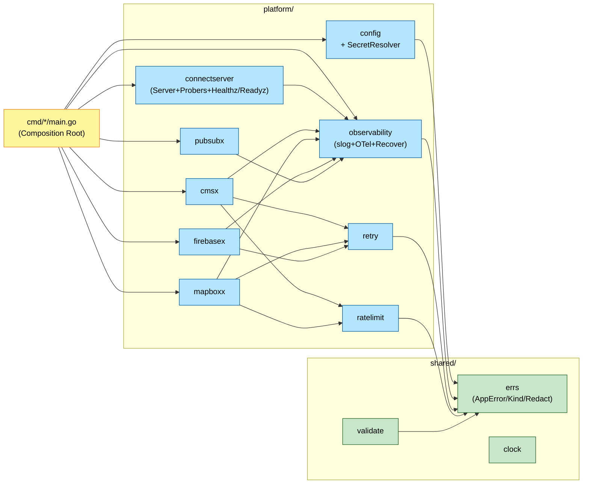

# U-PLT Logical Components

U-PLT の NFR Design で必要になった **論理コンポーネント**（インフラ的パーツ）の配置と責務、インターフェイスを定義する。

---

## 1. コンポーネント一覧

| # | 論理コンポーネント | パッケージ | 責務 | 対応 NFR-PLT |
|---|---|---|---|---|
| LC-01 | **Panic Recovery Middleware** | `internal/platform/observability` | Connect Interceptor / Job Runner での `recover` + 構造化ログ + `errs.KindInternal` ラップ + panic カウンタ | REL-02 |
| LC-02 | **Graceful Shutdown Orchestrator** | `cmd/*/main.go`（雛形を `platform/connectserver` 提供） | SIGTERM / SIGINT 受信 → 10 秒ドレイン → `observability.shutdown` → `os.Exit` | REL-01, AVAIL-01 |
| LC-03 | **Retry Policy Helper** | `internal/platform/retry` | `retry.Do(ctx, policy, op)` で指数バックオフ + ジッター + ShouldRetry 判定 | REL（再試行） |
| LC-04 | **Readiness Prober** | `internal/platform/connectserver` | `/healthz`（liveness）+ `/readyz`（依存先疎通）の 2 エンドポイント、Prober インターフェイス | REL-01 / OBS |
| LC-05 | **Rate Limiter** | `internal/platform/ratelimit` | Token Bucket（`golang.org/x/time/rate`）、Adapter から `Allow()` を呼ぶ | SEC（外部 API 保護） |
| LC-06 | **Secret Resolver** | `internal/platform/config` | env に Secret Manager リソース名が来たら起動時に実値解決 | SEC-01 |
| LC-07 | **PII Redactor** | `internal/shared/errs`（または `shared/pii`） | トークン / email をログ出力前に redact する関数 | SEC-04 |
| LC-08 | **Observability Setup** | `internal/platform/observability` | slog + OTel Metrics + Traces の 3 in 1 初期化、Setup/Shutdown 統合、`With`/`Logger`/`Tracer`/`Meter` API | OBS-01〜04 |
| LC-09 | **Config Loader** | `internal/platform/config` | envconfig 読み込み、必須検証、Secret Resolver 呼び出し、panic on missing | SEC-01, REL-01 |
| LC-10 | **Validation Helper** | `internal/shared/validate` | proto Request の共通バリデーション（必須 / 範囲 / 期間順序 / 座標境界） | — |
| LC-11 | **Clock Abstraction** | `internal/shared/clock` | `time.Now()` 抽象、テスト用 FixedClock 提供 | TEST（時間制御） |
| LC-12 | **Platform SDK Factories** | `internal/platform/{cmsx, firebasex, pubsubx, mapboxx}` | 各 SDK Client のシングルトン生成、Closer 実装、Prober 提供 | PERF, SEC |
| LC-13 | **AppError + Kind** | `internal/shared/errs` | 7 Kind の string 定数、`Wrap` / `IsKind` / `KindOf` / `Redact` | —（Functional Design で定義済み） |
| LC-14 | **Connect Interceptor Chain** | `internal/platform/connectserver` + `interfaces/rpc` | Recovery → Auth（U-USR 以降）→ Logging → Tracing → Metrics の順で積む | REL-02, OBS, SEC |

---

## 2. 各コンポーネントの詳細

### LC-01: Panic Recovery Middleware

```go
// platform/observability/recovery.go
package observability

func RecoverInterceptor() connect.UnaryInterceptorFunc
func WrapJobRun(ctx context.Context, name string, run func(context.Context) error) error
```

- Connect 側: Interceptor として登録（LC-14 の一番外側）
- Job 側: `WrapJobRun` を `Runner.Run()` の先頭で defer に入れる

### LC-02: Graceful Shutdown Orchestrator

`cmd/*/main.go` で使う共通雛形は `platform/connectserver.Serve(ctx, ...)` として提供。

```go
// platform/connectserver/server.go
type Server struct {
    httpServer *http.Server
    probers    []Prober
    interceptors []connect.Interceptor
    handlers   []HandlerRegistration
}

func New(cfg Config, handlers []HandlerRegistration, interceptors []connect.Interceptor) *Server
func (s *Server) Start(ctx context.Context) error   // ブロッキング、ctx キャンセルで Shutdown
func (s *Server) Stop(ctx context.Context) error    // 明示停止（テスト用）
```

### LC-03: Retry Policy Helper

```go
// platform/retry/retry.go
package retry

type Policy struct { /* MaxAttempts / Initial / Max / Multiplier / Jitter */ }
var DefaultPolicy Policy
func Do(ctx context.Context, p Policy, op func(context.Context) error) error
func ShouldRetry(err error) bool
```

### LC-04: Readiness Prober

```go
// platform/connectserver/readiness.go
type Prober interface {
    Name() string
    Probe(ctx context.Context) error
}

func HealthzHandler() http.HandlerFunc  // 常に 200
func ReadyzHandler(probers []Prober, timeout time.Duration) http.HandlerFunc
```

各 SDK factory が Prober を実装:

```go
// platform/cmsx/prober.go
func (c *Client) Prober() Prober { return &prober{c} }
type prober struct{ c *Client }
func (p *prober) Name() string { return "cms" }
func (p *prober) Probe(ctx context.Context) error { /* ping workspace */ }
```

### LC-05: Rate Limiter

```go
// platform/ratelimit/ratelimit.go
type Limiter struct { /* wraps *rate.Limiter + metrics hooks */ }
func New(rpm int, burst int, name string) *Limiter
func (l *Limiter) Allow() error  // errs.KindExternal on exceed
```

各 Adapter で利用:

```go
// platform/mapboxx/client.go
type Client struct {
    http    *http.Client
    limiter *ratelimit.Limiter
}

func (c *Client) Geocode(ctx context.Context, q string) (...) {
    if err := c.limiter.Allow(); err != nil { return ..., err }
    // HTTP 呼び出し、retry.Do で包む
}
```

### LC-06: Secret Resolver

```go
// platform/config/secretresolver.go
type Resolver struct { /* *secretmanager.Client */ }
func NewResolver(ctx context.Context, projectID string) (*Resolver, error)

// struct tag `secret:"true"` を付けた string フィールドを
// Secret Manager リソース名として解決し、実値に書き換える。
func (r *Resolver) Resolve(ctx context.Context, cfg any) error
```

使い方:

```go
type IngestionConfig struct {
    config.Config
    ClaudeAPIKey string `envconfig:"INGESTION_CLAUDE_API_KEY_SECRET" required:"true" secret:"true"`
    ...
}

var cfg IngestionConfig
envconfig.MustProcess("", &cfg)
r, _ := config.NewResolver(ctx, cfg.GCPProjectID)
_ = r.Resolve(ctx, &cfg)  // ClaudeAPIKey が実値に書き換わる
```

### LC-07: PII Redactor

```go
// shared/errs/redact.go
func Redact(s string) string
func RedactMap(m map[string]string) map[string]string
```

### LC-08: Observability Setup

```go
// platform/observability/setup.go
type Config struct {
    ServiceName string
    Env         string
    LogLevel    string
    ExporterKind string  // "stdout" | "gcp"
}

func Setup(ctx context.Context, cfg Config) (shutdown func(context.Context) error, err error)
func Logger(ctx context.Context) *slog.Logger
func Tracer(ctx context.Context) trace.Tracer
func Meter(ctx context.Context) metric.Meter
func With(ctx context.Context, key string, value any) context.Context
```

### LC-09: Config Loader

```go
// platform/config/config.go
type Config struct {
    ServiceName  string  `envconfig:"PLATFORM_SERVICE_NAME" required:"true"`
    Env          string  `envconfig:"PLATFORM_ENV" required:"true"`
    LogLevel     string  `envconfig:"PLATFORM_LOG_LEVEL" default:"INFO"`
    OTelExporter string  `envconfig:"PLATFORM_OTEL_EXPORTER" default:"stdout"`
    GCPProjectID string  `envconfig:"PLATFORM_GCP_PROJECT_ID" required:"true"`
}

// MustLoad は各 Deployable の Config 型に対して envconfig.MustProcess を呼び、
// 必要なら Secret Resolver を動かす。欠落時は log.Fatalf で終了。
func MustLoad[T any](ctx context.Context) *T
```

### LC-10: Validation Helper

```go
// shared/validate/validate.go
func NonEmpty(field string, v string) error
func IntRange(field string, v int, min, max int) error
func Float64Range(field string, v float64, min, max float64) error
func DurationOrder(fromField, toField string, from, to time.Time) error  // allows zero
func LatLng(lat, lng float64) error
```

### LC-11: Clock Abstraction

```go
// shared/clock/clock.go
type Clock interface { Now() time.Time }
type SystemClock struct{}
type FixedClock struct{ FixedTime time.Time }
func System() Clock       // 実装時は即 new、テストでは FixedClock を DI
```

### LC-12: Platform SDK Factories

各 Factory は以下の共通パターンに従う:

```go
// platform/<service>x/client.go
type Config struct { /* ... */ }
type Client struct { /* ... */ }

func NewClient(ctx context.Context, cfg Config) (*Client, error)
func (c *Client) Prober() Prober
func (c *Client) Close(ctx context.Context) error  // Closer インターフェイス実装
```

対象: `cmsx` / `firebasex` / `pubsubx` / `mapboxx`（将来 `claudex` 追加検討）

### LC-14: Connect Interceptor Chain

```go
// interfaces/rpc/server.go（BFF で U-BFF 時に完成させる）
var interceptors = []connect.Interceptor{
    observability.RecoverInterceptor(),     // 最外層
    observability.RequestIDInterceptor(),   // request_id 発行
    observability.LoggingInterceptor(),     // リクエストログ
    observability.TracingInterceptor(),     // OTel span
    observability.MetricsInterceptor(),     // RPC latency / status
    auth.Interceptor(verifier),             // 最内層（認証） — U-USR で追加
}
```

U-PLT の仕事: 認証以外の 5 Interceptor を `platform/observability` に実装。

---

## 3. 依存関係（U-PLT 内部）



- `shared/*` は `platform/*` に依存されるが、逆依存なし
- `platform/retry`, `ratelimit`, `observability` が Adapter 素材パッケージ（`cmsx`, `mapboxx`, `firebasex`）に再利用される

---

## 4. 実装優先順位（U-PLT Code Generation 時の手順案）

1. `shared/errs` + `shared/clock` + `shared/validate`（依存ゼロ、テスト容易）
2. `platform/config`（envconfig → Secret Resolver）
3. `platform/observability`（slog + OTel 初期化、Recovery / Logging / Tracing / Metrics Interceptor）
4. `platform/retry` + `platform/ratelimit`
5. `platform/connectserver`（Server / Probers / Interceptor Chain の足場）
6. `platform/cmsx` / `platform/mapboxx` / `platform/firebasex` / `platform/pubsubx`（SDK 薄ラッパ）
7. `proto/v1/*.proto` + `buf.yaml` + `buf.gen.yaml` + `gen/go/v1/*`
8. `cmd/*/main.go` の雛形（空の main、コメントで Composition 指針）

すべて U-PLT の **Code Generation** フェーズで段階的に生成する。

---

## 5. 他 Unit への引き継ぎ

U-CSS 以降の各 Unit は **以下の U-PLT 成果物を前提** に実装:

- [x] `config.MustLoad[T]` で独自 Config 型を読み込み
- [x] `observability.Setup` で初期化、`observability.Logger(ctx)` で slog
- [x] `cmsx.NewClient` / `mapboxx.NewClient` などで SDK 生成
- [x] `retry.Do` と `Limiter.Allow` を Adapter 実装で利用
- [x] `errs.Wrap` / `errs.Redact` でエラー・PII を扱う
- [x] Connect サービスを実装する場合は `connectserver.Register` で自動的に Interceptor Chain + Probers が付く
