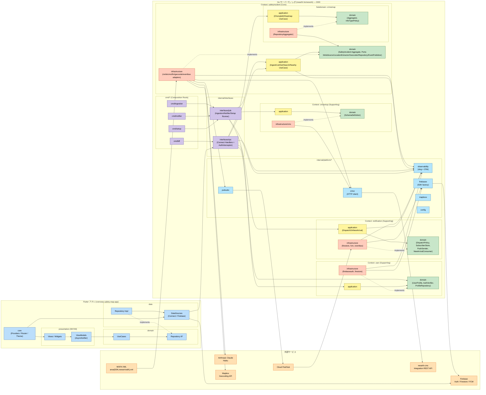
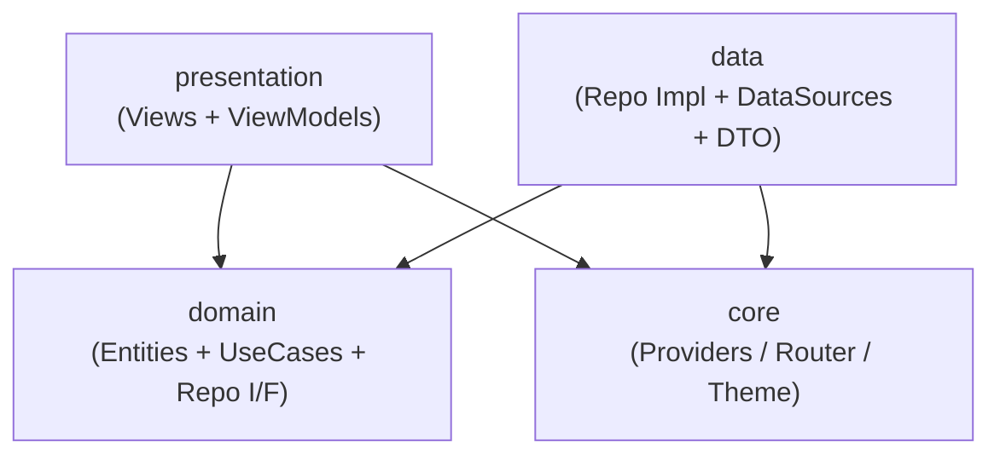
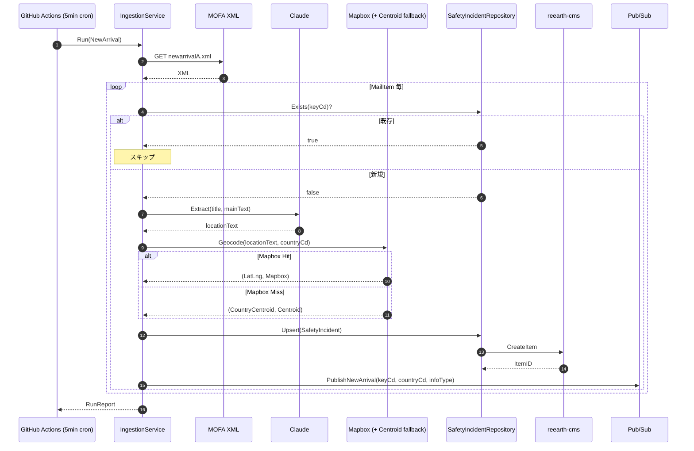
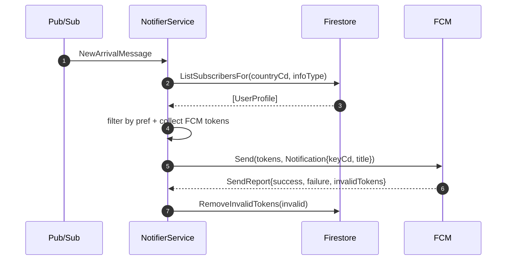
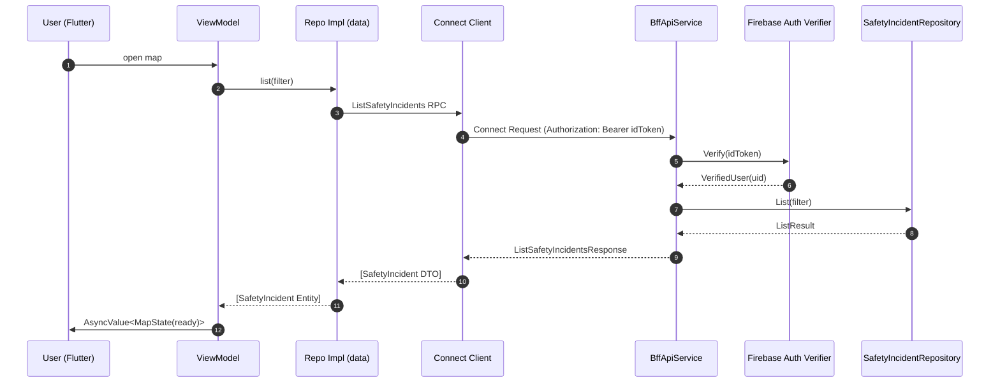
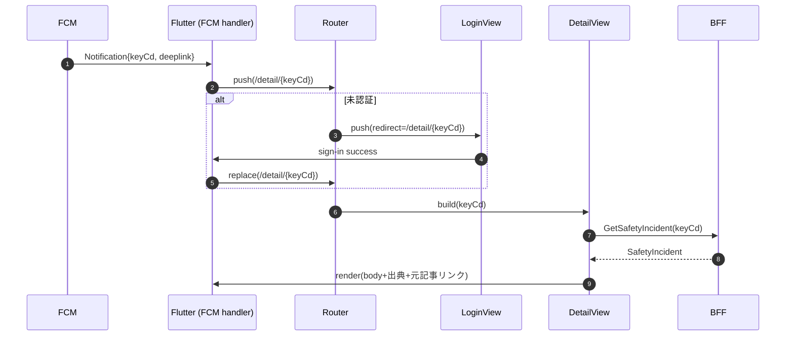

# 依存関係とデータフロー — overseas-safety-map

## 1. 全体依存図（コンポーネントレベル）

---

## 2. 依存マトリクス（Go 側）

行の要素 → 列の要素 に依存する、を示す。

各列は **Port（domain I/F）** で、行は **UseCase / Adapter / Interface レイヤ**。依存は `application → domain` が基本で、`infrastructure` は他 Context の domain を参照しない（Composition Root で組まれる）。

| From \ To (Port) | MofaSource | LocationExtractor | Geocoder | SI.Repository | EventPublisher | SubscriberStore | PushSender | AuthVerifier | ProfileRepository | cmsx.Client | crimemap.Aggregator | observability |
|---|:-:|:-:|:-:|:-:|:-:|:-:|:-:|:-:|:-:|:-:|:-:|:-:|
| `safetyincidentapp.IngestUseCase` | ✓ | ✓ | ✓ | ✓ | ✓ | — | — | — | — | — | — | ✓ |
| `safetyincidentapp.{List,Get,Search,Nearby}UseCase` | — | — | — | ✓ | — | — | — | — | — | — | — | ✓ |
| `crimemapapp.{Choropleth,Heatmap}UseCase` | — | — | — | — | — | — | — | — | — | — | ✓ | ✓ |
| `notificationapp.DispatchOnNewArrivalUseCase` | — | — | — | — | — | ✓ | ✓ | — | — | — | — | ✓ |
| `userapp.*` | — | — | — | — | — | — | — | — | ✓ | — | — | ✓ |
| `cmssetupapp.EnsureSchemaUseCase` | — | — | — | — | — | — | — | — | — | ✓ (Adapter 経由) | — | ✓ |
| `interfaces/rpc.AuthInterceptor` | — | — | — | — | — | — | — | ✓ | — | — | — | ✓ |
| `interfaces/rpc.*Handler` | — | — | — | — | — | — | — | — | — | — | — | ✓ |
| `safetyincident.infrastructure.cms.Repository` (Adapter) | — | — | — | — | — | — | — | — | — | ✓ | — | ✓ |
| `crimemap.infrastructure.RepositoryAggregator` (Adapter) | — | — | — | ✓ | — | — | — | — | — | — | — | ✓ |

**DDD レイヤ依存ルール**（Bounded Context 内）:
- `{context}/domain` は他のどこにも依存しない（標準ライブラリ + `time` + `errors` のみ）
- `{context}/application` → ✅ 同 Context の `domain` のみ
- `{context}/infrastructure/*` → ✅ 同 Context の `domain`（Port 実装）、`platform/*`、`shared/*`、generated proto
- `interfaces/rpc` → ✅ 複数 Context の `application`、`shared/*`、generated proto
- `interfaces/job` → ✅ 同一 UseCase グループの `application`、`shared/*`
- `platform/*` → ✅ `shared/*` のみ（ドメイン知識なし）
- `shared/*` → ❌ 他 `internal/*` 依存禁止
- `cmd/*`（Composition Root）→ ✅ 全方向 import 可（DI ワイヤリングのため）

**Context 間の結合ルール**:
- Context A の `application` / `infrastructure` が Context B の `domain` / `application` / `infrastructure` を **直接 import 禁止**
- 結合の許可チャネル:
  1. `interfaces/rpc` での Application Service オーケストレーション（BFF のみ、複数 Context を横断可）
  2. Domain Event を proto 化して Pub/Sub で受け渡し（`safetyincident.NewArrivalEvent` → `notification.NewArrivalMessage`）
  3. Composition Root（`cmd/*`）での DI 配線
- **例外（実用上の妥協）**: `user.domain` が `safetyincident.CountryCode` / `InfoType` を値オブジェクトとして参照する点のみ許可。これらは MOFA 由来の識別子コードで実質アプリ全体の共有語彙のため（Shared Kernel 相当、将来 `shared/codes` へ独立化する選択肢あり）。

**Context 別パッケージ一覧**（Go パッケージと配置先）:
| Context | domain | application | infrastructure |
|---|---|---|---|
| `safetyincident` | `internal/safetyincident/domain` → package `safetyincident` | `internal/safetyincident/application` → package `safetyincidentapp` | `internal/safetyincident/infrastructure/{mofa,cms,llm,geocode,eventbus}` |
| `safetyincident/crimemap` | `internal/safetyincident/crimemap/domain` → package `crimemap` | `internal/safetyincident/crimemap/application` → package `crimemapapp` | `internal/safetyincident/crimemap/infrastructure` → package `crimemapinfra` |
| `user` | `internal/user/domain` → package `user` | `internal/user/application` → package `userapp` | `internal/user/infrastructure/{firebaseauth,firestore}` |
| `notification` | `internal/notification/domain` → package `notification` | `internal/notification/application` → package `notificationapp` | `internal/notification/infrastructure/{firestore,fcm,eventbus}` |
| `cmssetup` | `internal/cmssetup/domain` → package `cmssetup` | `internal/cmssetup/application` → package `cmssetupapp` | `internal/cmssetup/infrastructure/cms` → package `cmsapplier` |
| Interface | — | — | `internal/interfaces/{rpc,job}` |
| Platform | — | — | `internal/platform/{config,observability,connectserver,pubsubx,cmsx,firebasex,mapboxx}` |
| Shared | — | — | `internal/shared/{errs,clock}` |

---

## 3. Flutter 側レイヤ依存

- **domain** は他のどのレイヤにも依存しない（Clean Architecture）
- **data** は **domain** に依存（Repo I/F の実装）
- **presentation** は **domain**（UseCase と Entity）と **core**（DI, Router）に依存
- **core** は Riverpod Provider 定義で **data** の Repo Impl を DI する（一方向の依存に留めるため Provider 登録のみ）

---

## 4. コミュニケーションパターン

| 呼び出し元 → 呼び出し先 | プロトコル | 認証 | 形式 |
|---|---|---|---|
| IngestionService → MOFA | HTTPS GET | なし | XML |
| IngestionService → Claude | HTTPS | API Key | JSON (Anthropic API) |
| IngestionService → Mapbox | HTTPS | API Key | JSON (Geocoding v6) |
| IngestionService → reearth-cms | HTTPS | Integration Token（Bearer） | JSON |
| IngestionService → Pub/Sub | gRPC (Google SDK) | Service Account | proto |
| Pub/Sub → NotifierService | Push / Pull | Service Account | proto |
| NotifierService → Firestore/FCM | gRPC (Firebase SDK) | Service Account | proto |
| Flutter → BFF | Connect (HTTPS) | Firebase ID Token（Bearer） | proto |
| BFF → reearth-cms | HTTPS | Integration Token | JSON |
| BFF → Firebase Auth | gRPC (Admin SDK) | Service Account | — |
| Flutter → Firestore | gRPC (Firebase SDK) | Firebase ID Token | proto |
| Flutter → FCM (登録) | gRPC (Firebase SDK) | 端末側 | — |

---

## 5. データフロー図

### 5.1 取り込みパイプライン（Ingestion Flow）

### 5.2 通知配信フロー（Notifier Flow）

### 5.3 Flutter → BFF 読み取りフロー

### 5.4 通知タップ → 詳細遷移フロー

---

## 6. 凝集・結合に関する原則

- **ドメインと実装の分離**: `internal/domain` は外部 I/O 型（HTTP レスポンス型、proto 生成型）を一切持たない。
- **インターフェイスは利用側パッケージに置く**: repository I/F は `internal/repository` に置き、CMS 実装はサブパッケージ。テスト時は同パッケージ内にモックを置いて差し替え可能。
- **Connect スキーマは唯一の契約**: `proto/v1/*.proto` が BFF と Flutter の唯一の契約。Go 側は `buf generate`、Dart 側も同 `.proto` から生成（別リポジトリへコピー or サブモジュール／CI でコピーするかは Infrastructure Design で決定）。
- **循環依存禁止**: Go / Flutter いずれも `go vet` / `lint` で循環を検出・CI で落とす。
- **Pub/Sub の契約**: メッセージ proto（`pubsub.proto`）も `proto/v1/` 以下に置き、ingestion / notifier で共有する。
