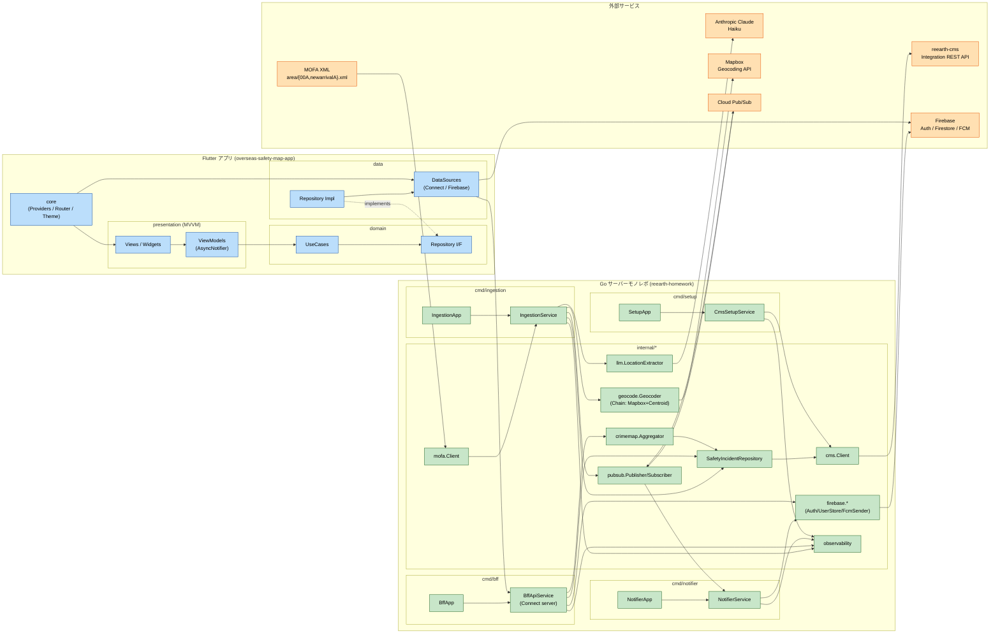
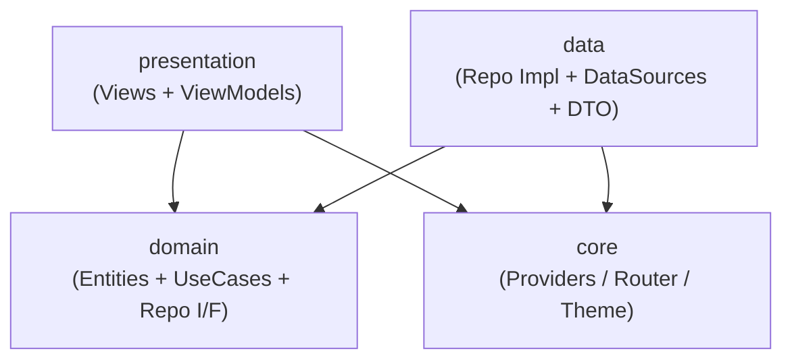
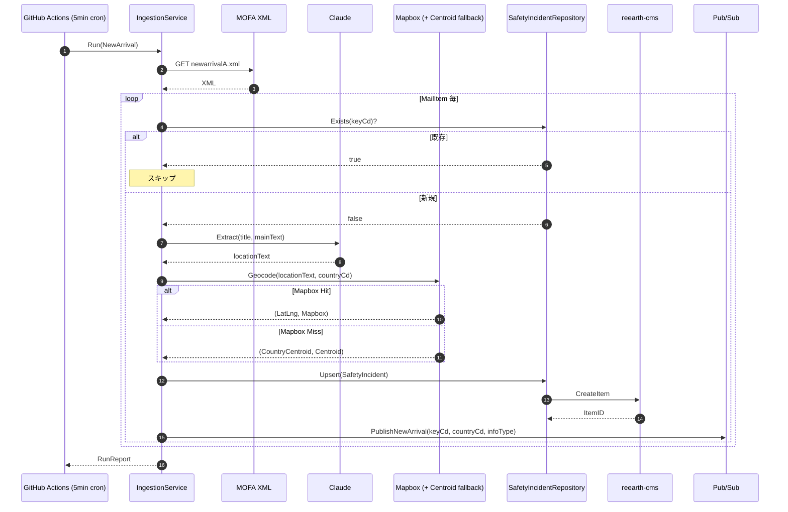
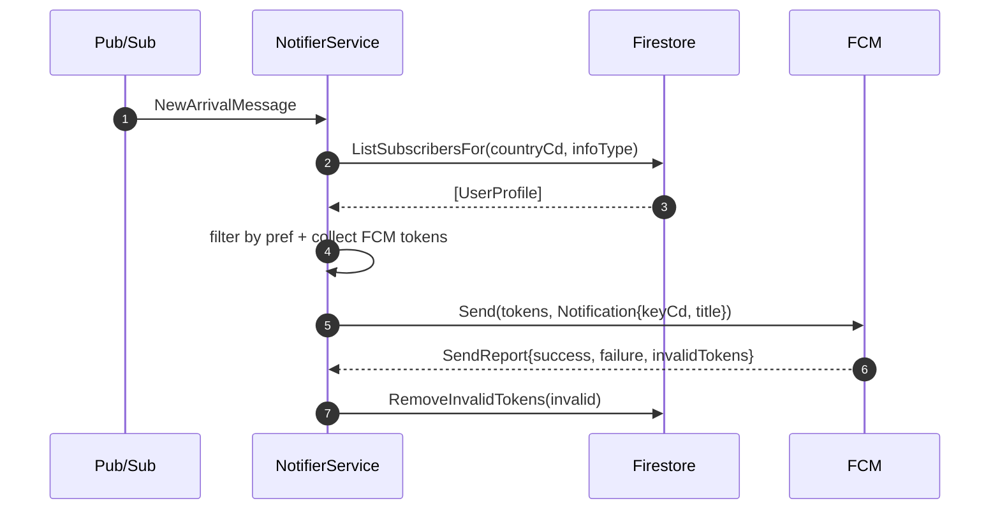
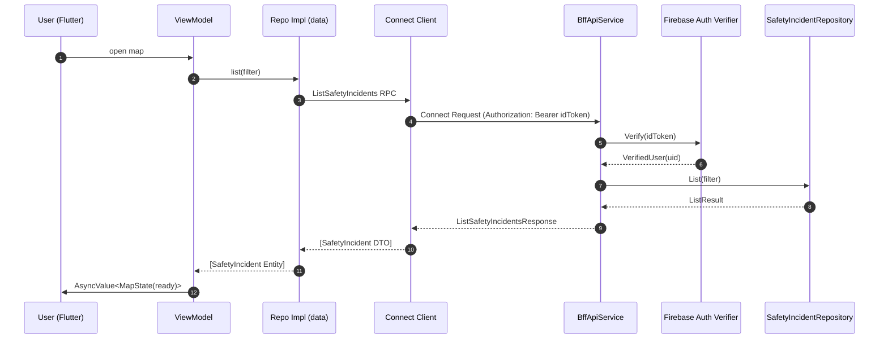
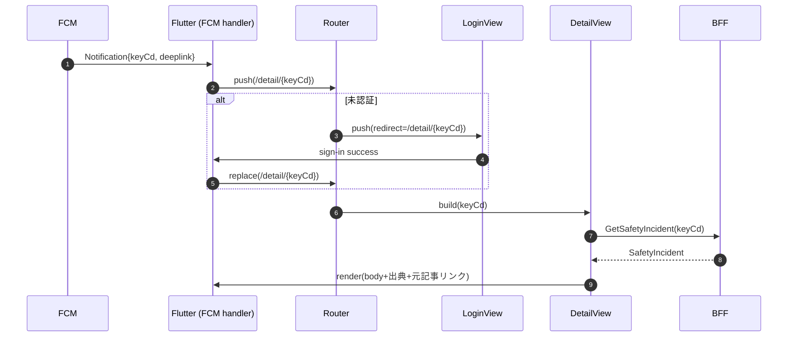

# 依存関係とデータフロー — overseas-safety-map

## 1. 全体依存図（コンポーネントレベル）

---

## 2. 依存マトリクス（Go 側）

行の要素 → 列の要素 に依存する、を示す。

| From \ To | MofaClient | LLM Extractor | Geocoder | Repository | CMS Client | Pub/Sub | Firebase | CrimeMap Agg | Observability |
|---|:-:|:-:|:-:|:-:|:-:|:-:|:-:|:-:|:-:|
| IngestionService | ✓ | ✓ | ✓ | ✓ | — | ✓ | — | — | ✓ |
| NotifierService | — | — | — | — | — | ✓ | ✓ | — | ✓ |
| BffApiService | — | — | — | ✓ | — | — | ✓ (Auth + UserStore) | ✓ | ✓ |
| CmsSetupService | — | — | — | — | ✓ | — | — | — | ✓ |
| Repository (CMSImpl) | — | — | — | — | ✓ | — | — | — | ✓ |
| CrimeMap Aggregator | — | — | — | ✓ | — | — | — | — | ✓ |

**内部パッケージの依存ルール**:
- `internal/domain` は他の `internal/*` に依存しない（純粋ドメイン）
- `internal/repository` → `internal/domain`, `internal/cms`（Impl のみ）
- `internal/bff` → `internal/repository`, `internal/firebase`, `internal/crimemap`, `internal/observability`, Connect generated code
- `internal/ingestion` → `internal/mofa`, `internal/llm`, `internal/geocode`, `internal/repository`, `internal/pubsub`, `internal/observability`
- `internal/notifier` → `internal/pubsub`, `internal/firebase`, `internal/observability`（必要に応じ `internal/repository` で title 補完）
- `cmd/*` はそれぞれのサービスと `internal/observability` だけを import（薄い main）

---

## 3. Flutter 側レイヤ依存

- **domain** は他のどのレイヤにも依存しない（Clean Architecture）
- **data** は **domain** に依存（Repo I/F の実装）
- **presentation** は **domain**（UseCase と Entity）と **core**（DI, Router）に依存
- **core** は Riverpod Provider 定義で **data** の Repo Impl を DI する（一方向の依存に留めるため Provider 登録のみ）

---

## 4. コミュニケーションパターン

| 呼び出し元 → 呼び出し先 | プロトコル | 認証 | 形式 |
|---|---|---|---|
| IngestionService → MOFA | HTTPS GET | なし | XML |
| IngestionService → Claude | HTTPS | API Key | JSON (Anthropic API) |
| IngestionService → Mapbox | HTTPS | API Key | JSON (Geocoding v6) |
| IngestionService → reearth-cms | HTTPS | Integration Token（Bearer） | JSON |
| IngestionService → Pub/Sub | gRPC (Google SDK) | Service Account | proto |
| Pub/Sub → NotifierService | Push / Pull | Service Account | proto |
| NotifierService → Firestore/FCM | gRPC (Firebase SDK) | Service Account | proto |
| Flutter → BFF | Connect (HTTPS) | Firebase ID Token（Bearer） | proto |
| BFF → reearth-cms | HTTPS | Integration Token | JSON |
| BFF → Firebase Auth | gRPC (Admin SDK) | Service Account | — |
| Flutter → Firestore | gRPC (Firebase SDK) | Firebase ID Token | proto |
| Flutter → FCM (登録) | gRPC (Firebase SDK) | 端末側 | — |

---

## 5. データフロー図

### 5.1 取り込みパイプライン（Ingestion Flow）

### 5.2 通知配信フロー（Notifier Flow）

### 5.3 Flutter → BFF 読み取りフロー

### 5.4 通知タップ → 詳細遷移フロー

---

## 6. 凝集・結合に関する原則

- **ドメインと実装の分離**: `internal/domain` は外部 I/O 型（HTTP レスポンス型、proto 生成型）を一切持たない。
- **インターフェイスは利用側パッケージに置く**: repository I/F は `internal/repository` に置き、CMS 実装はサブパッケージ。テスト時は同パッケージ内にモックを置いて差し替え可能。
- **Connect スキーマは唯一の契約**: `proto/v1/*.proto` が BFF と Flutter の唯一の契約。Go 側は `buf generate`、Dart 側も同 `.proto` から生成（別リポジトリへコピー or サブモジュール／CI でコピーするかは Infrastructure Design で決定）。
- **循環依存禁止**: Go / Flutter いずれも `go vet` / `lint` で循環を検出・CI で落とす。
- **Pub/Sub の契約**: メッセージ proto（`pubsub.proto`）も `proto/v1/` 以下に置き、ingestion / notifier で共有する。
