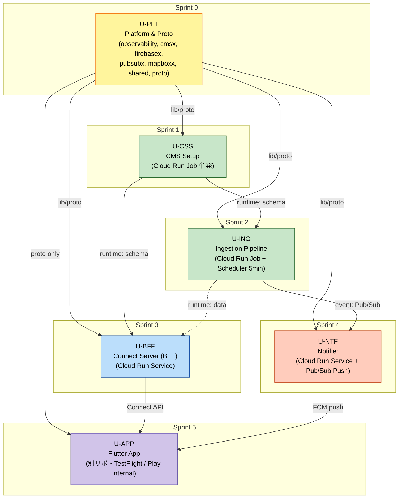

# Unit 依存関係 — overseas-safety-map

## 1. 依存マトリクス

行（上流 Unit）が列（下流 Unit）を **提供する** / 列が行を **必要とする** 関係を示す。`✓` = 下流 Unit が完成に向けて当該上流 Unit の成果物を参照・依存する。

| 上流 ＼ 下流 | U-PLT | U-CSS | U-ING | U-BFF | U-NTF | U-APP |
|---|:-:|:-:|:-:|:-:|:-:|:-:|
| **U-PLT** | —   | ✓    | ✓    | ✓    | ✓    | ✓ (proto 共有のみ) |
| **U-CSS** | —   | —    | ✓    | ✓    | —    | — |
| **U-ING** | —   | —    | —    | △ (実データ検証用) | ✓ | — |
| **U-BFF** | —   | —    | —    | —    | —    | ✓ |
| **U-NTF** | —   | —    | —    | —    | —    | ✓ (実機通知検証) |
| **U-APP** | —   | —    | —    | —    | —    | — |

- ✓: 下流 Unit の **完成判定に必須** な依存
- △: 下流 Unit の **検証価値を高める** が、疎通確認だけなら U-CSS 完了で可

## 2. 依存種別

| 依存 | 種別 | 具体例 |
|---|---|---|
| U-PLT → U-CSS | コード import（Go） | `platform/cmsx`, `platform/config`, `shared/errs` |
| U-PLT → U-ING | コード import（Go） | `platform/cmsx`, `platform/pubsubx`, `platform/mapboxx`, `platform/observability` |
| U-PLT → U-BFF | コード import（Go） | `platform/connectserver`, `platform/firebasex`, `platform/cmsx`, `platform/observability` |
| U-PLT → U-NTF | コード import（Go） | `platform/pubsubx`, `platform/firebasex`, `platform/observability` |
| U-PLT → U-APP | proto 契約 | `proto/v1/*.proto` が Dart コード生成源（Go 側の `buf generate` 出力と同じスキーマ） |
| U-CSS → U-ING | **ランタイム前提**（データストア） | ingestion が書き込む CMS Model / Field は U-CSS で作成されている必要がある |
| U-CSS → U-BFF | ランタイム前提 | BFF が読み取る Model は U-CSS で作成済み |
| U-ING → U-BFF | ランタイム前提（データ存在） | 実データが CMS にないと BFF の動作確認が空になる |
| U-ING → U-NTF | **イベント契約**（Pub/Sub） | `NewArrivalEvent` を ingestion が publish、notifier が subscribe |
| U-BFF → U-APP | **API 契約**（Connect） | Flutter 側の DataSource が Connect クライアントで呼ぶ |
| U-NTF → U-APP | **通知契約**（FCM） | Flutter 側の FCM handler が通知を受けて deeplink 遷移 |

## 3. Mermaid 依存図



## 4. 並行化の余地

MVP では 1 人開発（Q5 [A]）のため基本は順次進行だが、Unit 内の部分並行は可能:
- **U-ING vs U-BFF**: U-CSS 完了後は独立して進行可（互いの完了を待たなくても実装は進められる、結合検証のみ同期）。
- **U-NTF vs U-APP**: U-BFF と独立。ingestion が publish を実装済みなら、U-NTF の開発と U-APP の開発は並行可能。
- **U-APP のリポジトリ初期化**: U-PLT の proto を参照するだけなので、Sprint 0 と並行にプロジェクト scaffold を進めても良い。

## 5. Critical Path

```
U-PLT → U-CSS → U-ING → U-BFF → U-APP
```
最短クリティカルパス = 5 Unit。U-NTF は U-ING 完了後に並行着手して U-APP と同時進行可能（最終統合は U-APP 内で検証）。

## 6. ロールバック単位

| Unit | ロールバック方法 |
|---|---|
| U-PLT | Go module バージョン戻し、proto のバージョンは `v1` を破壊せず `v2` で切替（Connect 仕様） |
| U-CSS | CMS 側は手動で Field を無効化、Schema は冪等なので古いバージョンを再適用 |
| U-ING | Cloud Run Job のリビジョン戻し、問題 Item は `keyCd` 指定で手動削除 |
| U-BFF | Cloud Run Service の traffic を前リビジョンに 100% 切替（Blue/Green） |
| U-NTF | Cloud Run Service のリビジョン戻し、Pub/Sub push は DLQ に退避される |
| U-APP | App Store Connect / Play Console で前ビルド配信に戻す |
