# Execution Plan — overseas-safety-map

## Detailed Analysis Summary

### Change Impact Assessment
| 観点 | 影響 | 内容 |
|---|---|---|
| User-facing changes | Yes | Flutter iOS/Android アプリ（認証 must、地図・一覧・詳細・検索・現在地・通知・犯罪マップ・情報ページ）を新規実装 |
| Structural changes | Yes | 取り込みパイプライン（Go）、BFF（Go）、reearth-cms SaaS、Firebase（Auth / Firestore / FCM）、Mapbox の新規統合 |
| Data model changes | Yes | reearth-cms 安全情報モデル（`keyCd`, `title`, `mainText`, `geometry` ほか） / Firestore のユーザープロファイル / 通知設定スキーマを新規設計 |
| API changes | Yes | BFF 公開 API（一覧 / 詳細 / GeoJSON / 検索 / 犯罪マップ集計）を新規定義 |
| NFR impact | Yes | Security Baseline / PBT 拡張が有効。構造化ログ・監視・アラート・認証認可・CC BY 4.0 出典表記・フォールバック UX が MVP 要件 |

### Risk Assessment
- **Risk Level**: **Medium-High**
  - 新規グリーンフィールド、複数サブシステム（パイプライン・BFF・Flutter・Firebase・CMS）
  - 外部サービス依存（MOFA XML・Mapbox Geocoding・LLM・reearth-cms SaaS）
  - LLM 地名抽出の品質は未知数で、フォールバック設計が必須
  - CC BY 4.0 互換ライセンスでの出典表記規約遵守
- **Rollback Complexity**: **Moderate**
  - CMS の Item 削除とコンテナ／関数の再デプロイで戻せる
  - アプリは TestFlight / Internal Testing のため本番ユーザー影響は小
- **Testing Complexity**: **Complex**
  - ユニット＋ウィジェット＋結合＋PBT の複合戦略（NFR-TEST-01〜03）
  - 外部 API のモックとゴールデンパスの両立が必要

---

## Workflow Visualization

```mermaid
flowchart TD
    Start(["User Request<br/>外務省オープンデータ × reearth-cms × Flutter"])

    subgraph INCEPTION["🔵 INCEPTION PHASE"]
        WD["Workspace Detection<br/><b>COMPLETED</b>"]
        RE["Reverse Engineering<br/><b>SKIPPED (Greenfield)</b>"]
        RA["Requirements Analysis<br/><b>COMPLETED</b>"]
        US["User Stories<br/><b>COMPLETED</b>"]
        WP["Workflow Planning<br/><b>IN PROGRESS</b>"]
        AD["Application Design<br/><b>EXECUTE</b>"]
        UP["Units Planning<br/><b>EXECUTE</b>"]
        UG["Units Generation<br/><b>EXECUTE</b>"]
    end

    subgraph CONSTRUCTION["🟢 CONSTRUCTION PHASE"]
        FD["Functional Design<br/><b>EXECUTE</b>"]
        NFRA["NFR Requirements<br/><b>EXECUTE</b>"]
        NFRD["NFR Design<br/><b>EXECUTE</b>"]
        ID["Infrastructure Design<br/><b>EXECUTE</b>"]
        CG["Code Generation<br/>(Planning + Generation)<br/><b>EXECUTE</b>"]
        BT["Build and Test<br/><b>EXECUTE</b>"]
    end

    subgraph OPERATIONS["🟡 OPERATIONS PHASE"]
        OPS["Operations<br/><b>PLACEHOLDER</b>"]
    end

    Start --> WD
    WD --> RA
    RA --> US
    US --> WP
    WP --> AD
    AD --> UP
    UP --> UG
    UG --> FD
    FD --> NFRA
    NFRA --> NFRD
    NFRD --> ID
    ID --> CG
    CG --> BT
    BT --> OPS
    OPS --> End(["Complete"])

    style WD fill:#4CAF50,stroke:#1B5E20,stroke-width:3px,color:#fff
    style RE fill:#BDBDBD,stroke:#424242,stroke-width:2px,stroke-dasharray: 5 5,color:#000
    style RA fill:#4CAF50,stroke:#1B5E20,stroke-width:3px,color:#fff
    style US fill:#4CAF50,stroke:#1B5E20,stroke-width:3px,color:#fff
    style WP fill:#FFA726,stroke:#E65100,stroke-width:3px,stroke-dasharray: 5 5,color:#000
    style AD fill:#FFA726,stroke:#E65100,stroke-width:3px,stroke-dasharray: 5 5,color:#000
    style UP fill:#FFA726,stroke:#E65100,stroke-width:3px,stroke-dasharray: 5 5,color:#000
    style UG fill:#FFA726,stroke:#E65100,stroke-width:3px,stroke-dasharray: 5 5,color:#000
    style FD fill:#FFA726,stroke:#E65100,stroke-width:3px,stroke-dasharray: 5 5,color:#000
    style NFRA fill:#FFA726,stroke:#E65100,stroke-width:3px,stroke-dasharray: 5 5,color:#000
    style NFRD fill:#FFA726,stroke:#E65100,stroke-width:3px,stroke-dasharray: 5 5,color:#000
    style ID fill:#FFA726,stroke:#E65100,stroke-width:3px,stroke-dasharray: 5 5,color:#000
    style CG fill:#4CAF50,stroke:#1B5E20,stroke-width:3px,color:#fff
    style BT fill:#4CAF50,stroke:#1B5E20,stroke-width:3px,color:#fff
    style OPS fill:#FFF59D,stroke:#F57F17,stroke-width:2px,color:#000
    style Start fill:#CE93D8,stroke:#6A1B9A,stroke-width:3px,color:#000
    style End fill:#CE93D8,stroke:#6A1B9A,stroke-width:3px,color:#000

    linkStyle default stroke:#333,stroke-width:2px
```

---

## Phases to Execute

### 🔵 INCEPTION PHASE
- [x] **Workspace Detection** — COMPLETED
- [x] **Reverse Engineering** — SKIPPED（Greenfield）
- [x] **Requirements Analysis** — COMPLETED（PR #1 merged）
- [x] **User Stories** — COMPLETED（PR #2 merged、13 MVP ストーリー）
- [x] **Workflow Planning** — IN PROGRESS（本ドキュメント）
- [ ] **Application Design** — **EXECUTE**
  - **Rationale**: 複数サブシステム（取り込みパイプライン / BFF / Flutter アプリ / CMS セットアップスクリプト）の責務分割、repository パターンによるデータソース抽象化、LLM / ジオコーダのインターフェイス化など、コンポーネント設計が不可欠。
- [ ] **Units Planning** — **EXECUTE**
  - **Rationale**: 13 MVP ストーリーを横断する複数ユニット（パッケージ）を構造化して扱う必要がある。Go 側モジュール・Flutter パッケージ・共通型定義の境界を事前に決める。
- [ ] **Units Generation** — **EXECUTE**
  - **Rationale**: ユニット単位のスキャフォールドとディレクトリ構造、依存関係を事前に生成し、Construction フェーズで各ユニットをループ実装する基盤を作る。

### 🟢 CONSTRUCTION PHASE
- [ ] **Functional Design** — **EXECUTE**
  - **Rationale**: LLM 地名抽出 → Mapbox ジオコーディング → フォールバックの分岐ロジック、通知の集約・配信ロジック、犯罪マップのズーム閾値・フォールバック除外規則など、機能レベルの仕様詳細化が必要。
- [ ] **NFR Requirements** — **EXECUTE**
  - **Rationale**: Security Baseline / PBT 拡張が有効（aidlc-state.md）。監視・ログ・アラートを MVP で実装するため、具体的メトリクスと SLO／SLI、脆弱性スキャン対象、PBT 対象関数の範囲を明文化する必要がある。
- [ ] **NFR Design** — **EXECUTE**
  - **Rationale**: Firebase セキュリティルール、Integration token 管理、HTTPS／ID Token 検証、Firestore アクセス制御、構造化ログのスキーマ、アラート閾値など具体的な設計が必要。
- [ ] **Infrastructure Design** — **EXECUTE**
  - **Rationale**: GitHub Actions スケジューラ・Cloud Run / Functions などのホスティング、Firebase プロジェクト設定、reearth.io SaaS 連携、シークレット管理（GitHub Secrets / Secret Manager）、CI/CD パイプラインなどインフラ一式の設計が必要。
- [ ] **Code Generation** — **EXECUTE**（必須）
  - **Rationale**: 実装に必要。
- [ ] **Build and Test** — **EXECUTE**（必須）
  - **Rationale**: ユニット＋ウィジェット＋結合＋PBT の複合テスト戦略（NFR-TEST-01〜03）を CI で回す。

### 🟡 OPERATIONS PHASE
- [ ] **Operations** — **PLACEHOLDER**
  - **Rationale**: 本 MVP の範囲外（本番監視・アラート配信・オンコールは Construction 内の観測性設計で実現する）。将来の運用改善サイクルのためのプレースホルダー。

---

## Stages to Skip (with reasons)

| Stage | Skip Reason |
|---|---|
| Reverse Engineering | Greenfield（既存コード無し）。workspace-detection でスキップ決定済み。 |
| Operations（本格実装） | MVP フェーズ外。Construction 段階で組み込む監視・ログ・アラート以上の運用業務（オンコール体制・SLA 契約等）は将来の拡張で扱う。 |

---

## Success Criteria

### Primary Goal
外務省 海外安全情報オープンデータを 5分毎に取り込み、LLM 抽出 + ジオコーディングで緯度経度化した安全情報を reearth-cms に蓄積し、Flutter アプリ（iOS/Android）で地図・一覧・詳細・検索・現在地・通知・**犯罪マップ**の全機能を、認証必須・MOFA 出典表記遵守・監視／ログ／アラート付きで提供する MVP を完成させる。

### Key Deliverables
1. **取り込みパイプライン（Go）**: GitHub Actions で 5分毎スケジュール実行、XML 取得 → LLM 抽出 → Mapbox Geocode → CMS Item 登録、フォールバック付き、構造化ログ出力。
2. **reearth-cms（reearth.io SaaS）**: Workspace 手動、Project/Model/Field はセットアップスクリプトで自動作成、安全情報モデルに必要フィールド（keyCd, title, mainText, geometry, etc.）完備。
3. **BFF（Go）**: Firebase ID Token 検証、一覧 / 詳細 / GeoJSON / 検索 / 犯罪マップ集計 API、repository パターンで CMS → DB 差し替え可能、構造化ログ。
4. **Flutter アプリ（iOS/Android）**: ログイン必須、13 MVP ストーリーに対応する画面、flutter_map、Firebase Auth / Firestore / FCM 連携、日英バイリンガル、MOFA 出典表記。
5. **CI/CD**: GitHub Actions で単体 / ウィジェット / 結合テスト、PBT、依存脆弱性スキャン、Go バイナリ & Flutter アプリのビルド、TestFlight / Play Console Internal Testing への配信。
6. **運用観測性**: 構造化ログ（ingestion / BFF / アプリクラッシュ）、メトリクス（ingestion 成功率 / ジオコーディング成功率 / BFF エラー率 / レイテンシ）、アラート通知。

### Quality Gates
- [ ] すべての MVP ストーリー（US-01〜US-13）の GWT 受け入れ基準が結合テストまたは手動テストでパスする
- [ ] PBT / ユニットテストが地名抽出・ジオコーディング・XML パーサ・repository で緑
- [ ] Flutter ウィジェットテストでログイン→各画面の遷移がカバーされている
- [ ] 脆弱性スキャンで Critical / High がゼロ
- [ ] MOFA 出典表記が US-01 / US-05 / US-11 / US-13 で表示されている
- [ ] 監視ダッシュボード・アラート設定が有効
- [ ] Firebase セキュリティルールが単体テストで検証済み

---

## Estimated Timeline

**目安**（MVP 完成までの工数感、参考値）
- Application Design + Units Planning + Units Generation: 2〜3 日
- Functional Design + NFR Requirements + NFR Design + Infrastructure Design: 3〜5 日
- Code Generation（パイプライン / BFF / Flutter / セットアップスクリプト）: 10〜15 日
- Build & Test（CI 構築、テスト実装、結合確認、TestFlight 配信）: 5〜7 日
- **合計**: 20〜30 日（1人日換算、AI 支援前提）

---

## Current Status

- **Lifecycle Phase**: INCEPTION
- **Current Stage**: Workflow Planning（本ドキュメント生成完了、承認待ち）
- **Next Stage**: Application Design
- **Status**: Ready to proceed after approval
